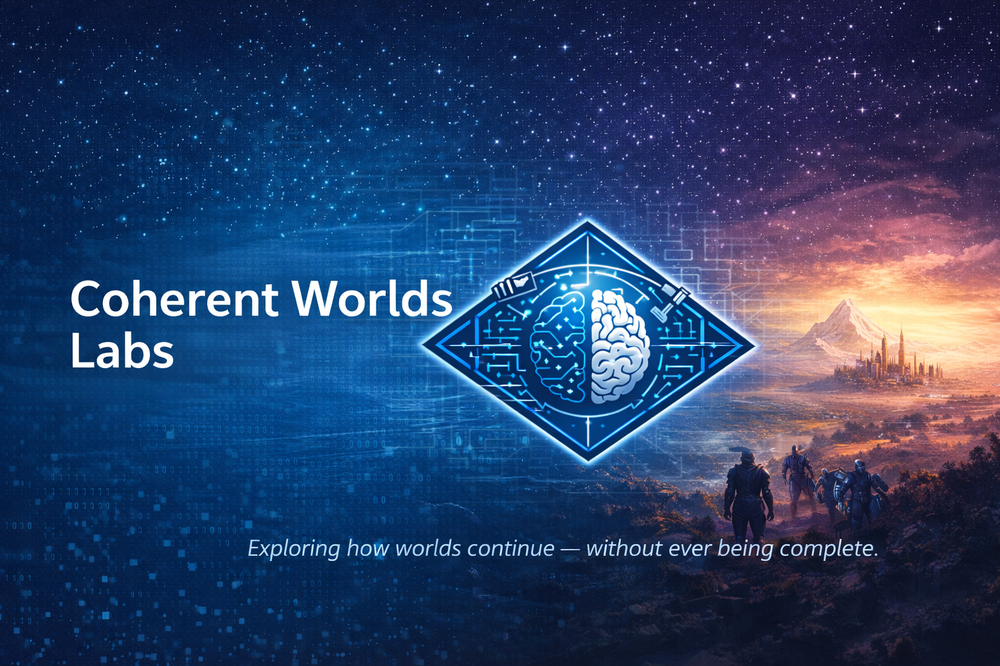

# Coherent Worlds Labs

**Coherent Worlds Labs** is a research initiative dedicated to studying how worlds can
persist, evolve, and remain meaningful under conditions of incomplete information.

We explore **Coherent World Continuation (CWC)** as a fundamental phenomenon:
the process by which a shared world is extended over time without ever being fully known,
fully specified, or fully resolved.

This organization hosts experiments, theoretical work, and prototypes
investigating how coherence can be maintained without truth, certainty, or closure.

---

## The Core Question

Most systems assume that progress means reducing uncertainty.

We ask a different question:

> *How can a world continue coherently  
> when uncertainty is not a temporary flaw,  
> but a permanent structural condition?*

Coherent Worlds Labs exists to explore this question in depth.

---

## What We Mean by “World”

In our work, a **world** is not a database, a state vector, or a complete description.

A world is:
- partially observable,
- historically constrained,
- semantically structured,
- and never fully accessible to any single participant.

No one ever sees the whole world.
Everyone interacts with **projections**.

Yet the world persists.

---

## Coherence Over Truth

We deliberately separate **coherence** from **truth**.

A coherent world:
- does not contradict itself,
- preserves implicit relationships,
- remains compatible with multiple interpretations,
- and allows future developments without collapse.

A coherent continuation does **not** need to:
- resolve ambiguity,
- converge to a single explanation,
- or reveal what “really happened”.

Uncertainty is not eliminated — it is managed.

---

## Continuation as a Primitive

In Coherent Worlds Labs, **continuation** is treated as a first-class concept.

To continue a world means:
- adding something new,
- without breaking what is already implicit,
- without prematurely closing open questions,
- without requiring full knowledge of the past.

This makes continuation:
- path-dependent,
- non-parallelizable,
- and inherently difficult to formalize.

---

## Why This Matters

Many real systems behave like coherent worlds:

- social realities,
- shared narratives,
- long-horizon reasoning environments,
- multi-agent contexts,
- collective sense-making processes.

They do not fail because they lack information.
They fail because coherence breaks.

Understanding continuation under uncertainty is therefore not a literary concern —
it is a structural one.

---

## Research Directions

Across repositories and experiments, we explore questions such as:

- How can coherence be evaluated without formal proof?
- What kinds of pressure destabilize a world?
- How does ambiguity accumulate over time?
- When does a world collapse, stagnate, or fragment?
- How can agents coordinate without shared ground truth?

Different projects address these questions from different angles.

---

## What This Is Not

Coherent Worlds Labs is **not**:

- a storytelling platform,
- a truth-discovery mechanism,
- a deterministic simulation engine,
- or a closed philosophical system.

It is an open-ended research space.

---

## Philosophy

We treat coherence as a scarce resource.

> Meaning does not emerge from certainty.  
> It emerges from continuity under constraint.

---

## Organization Structure

This organization hosts multiple repositories, including:

- foundational theory of Coherent World Continuation,
- experimental world engines and simulations,
- agent-based continuation environments,
- applied prototypes exploring long-term coherence.

Each repository focuses on a specific aspect of the broader research agenda.

---

## Status

Coherent Worlds Labs is an active research effort.
Concepts, terminology, and approaches are expected to evolve.

Stability is not assumed.
Coherence is studied precisely because it is fragile.

---

## License and Contributions

Most repositories are open for research and experimentation.
Licensing and contribution rules are defined per repository.

If you are interested in contributing, start by reading the repository-specific
README and contribution guidelines.

---

**Coherent Worlds Labs**  
Exploring how worlds continue — without ever being complete.
